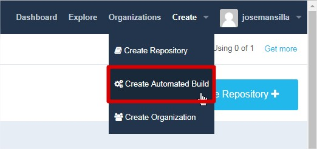
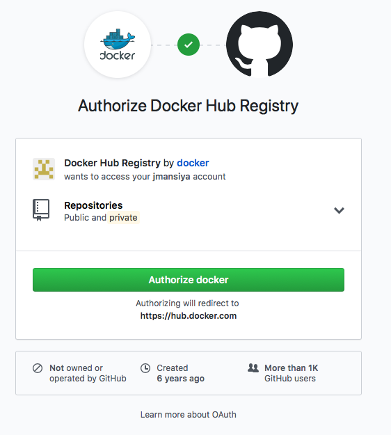
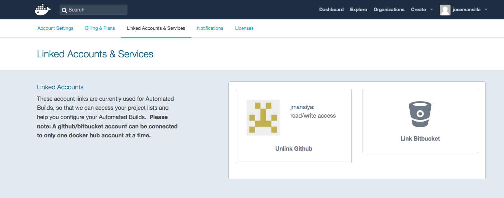
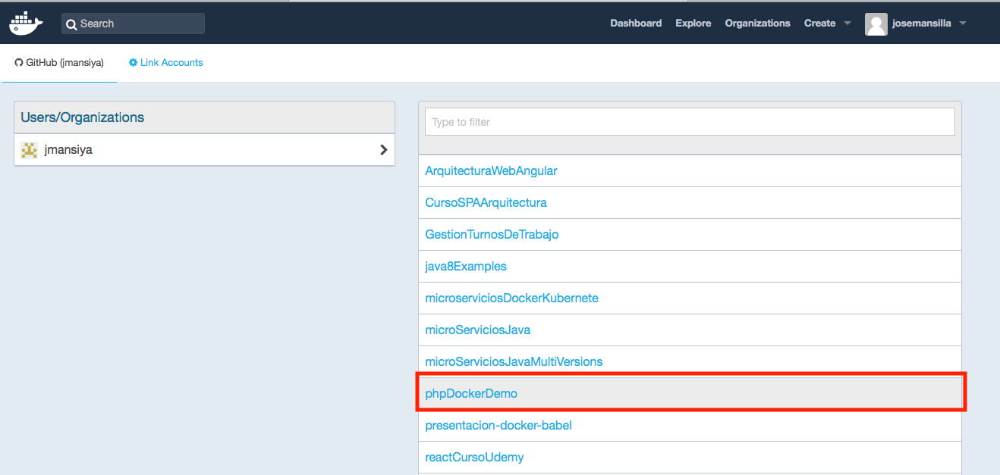
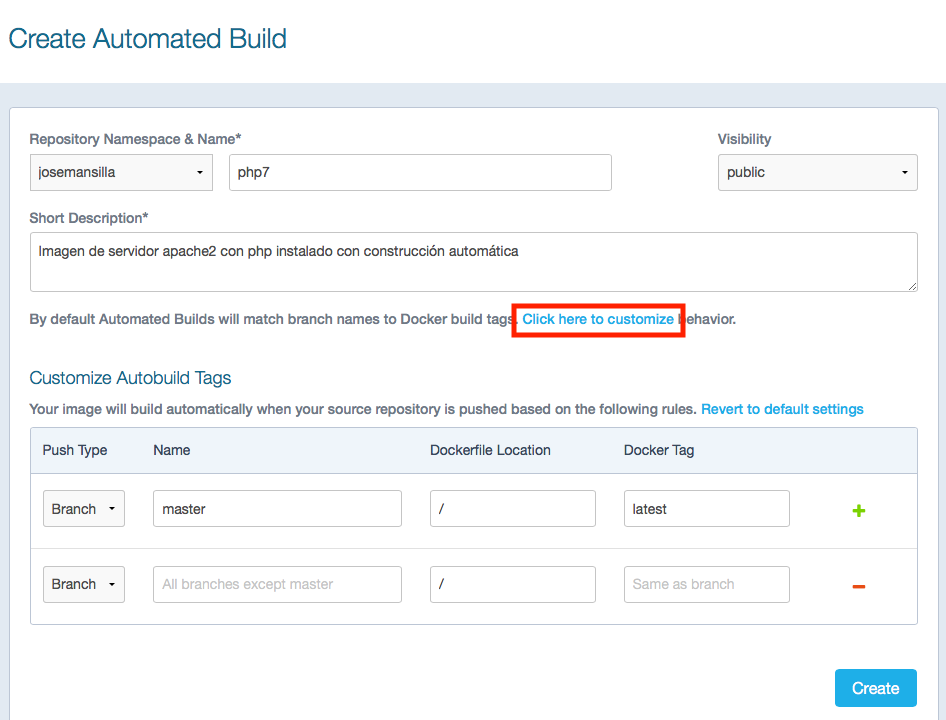
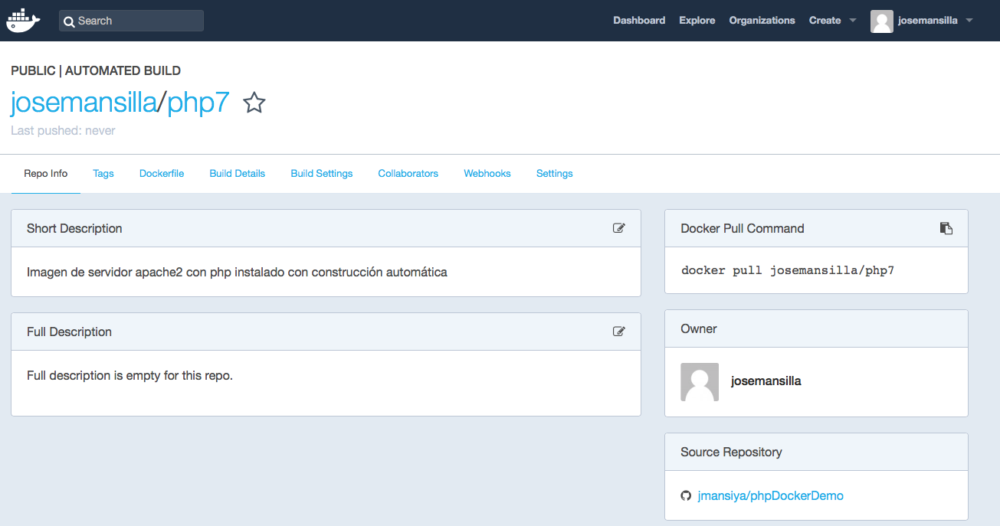
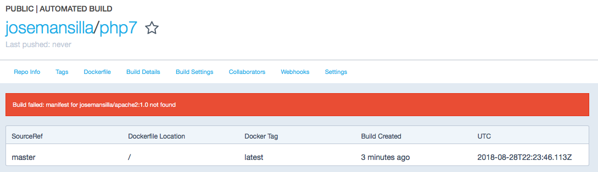
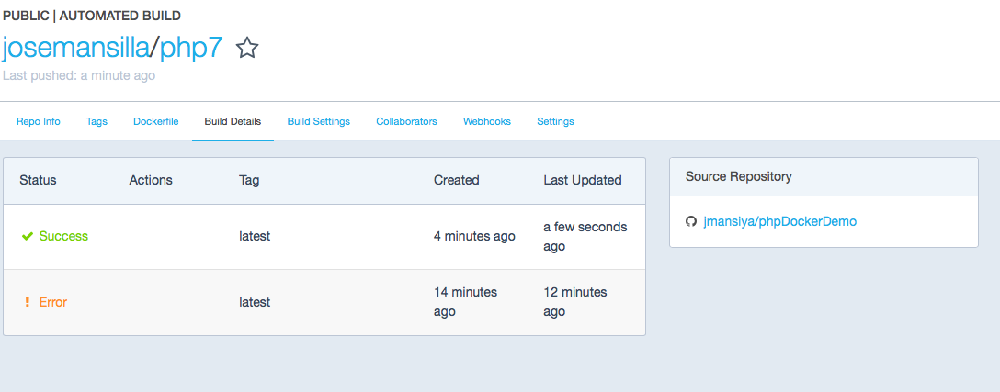

# EQUIPO ARQUITECTURA BABEL. 

## DEMO. DOCKERFILE.
En este apartado de la demo explicaremos brevemente la generación de imágenes docker mediante Dockerfiles.

### GENERACIÓN DE IMAGEN A PARTIR DE UN FICHERO DOCKERFILE.

En la demo anterior, estudiamos un método para crear nuevas imágenes a partir de contenedores que anteriormente habíamos configurado. En esta entrada vamos a presentar la forma más usual de crear nuevas imágenes: usando el comando docker buid y definiendo las características que queremos que tenga la imagen en un fichero Dockerfile.

Un **Dockerfile** es un fichero de texto donde indicamos los comandos que queremos ejecutar sobre una imagen base para crear una nueva imagen. El comando docker build construye la nueva imagen leyendo las instrucciones del fichero Dockerfile y la información de un entorno. Tenemos que tener en cuenta que cada instrucción ejecutada crea una imagen intermedia.


**Buenas prácticas al crear Dockerfile**

**1 - Los contenedores deber ser “efímeros"**
Cuando decimos “efímeros” queremos decir que la creación, parada, despliegue de los contenedores creados a partir de la imagen que vamos a generar con nuestro Dockerfile debe tener una mínima configuración.

**2 - Uso de ficheros .dockerignore**
Como hemos indicado anteriormente, todos los ficheros del contexto se envían al docker engine, es recomendable usar un directorio vacío donde vamos creando los ficheros que vamos a enviar. Además, para aumentar el rendimiento, y no enviar al daemon ficheros innecesarios podemos hacer uso de un fichero .dockerignore, para excluir ficheros y directorios.

**3 - No instalar paquetes innecesarios**
Para reducir la complejidad, dependencias, tiempo de creación y tamaño de la imagen resultante, se debe evitar instalar paquetes extras o innecesarios Si algún paquete es necesario durante la creación de la imagen, lo mejor es desinstalarlo durante el proceso.

**4 - Minimizar el número de capas**
Debemos encontrar el balance entre la legibilidad del Dockerfile y minimizar el número de capa que utiliza.

**5 - Indicar las instrucciones a ejecutar en múltiples líneas**
Cada vez que sea posible y para hacer más fácil futuros cambios, hay que organizar los argumentos de las instrucciones que contengan múltiples líneas, esto evitará la duplicación de paquetes y hará que el archivo sea más fácil de leer. Por ejemplo:

```javascript
RUN apt-get update && apt-get install -y \
git \
wget \
apache2 \
php5
```

### Creación de imagen con el servidor web apache2 con Dockerfile.

Para ello primero creamos un directorio vacio donde añadiremos un fichero index.html y el fichero Dockerfile para la generación de la imagen:

        $ mkdir apache
        $ cd apache/
        $ echo "<h1>Prueba de funcionamiento contenedor docker</h1>">index.html

Creamos el siguiente fichero Dockerfile en el mismo directorio apache que acabamos de crear:

```javascript
FROM debian
MAINTAINER José Mansilla García-Gil "jose.mansilla@babel.es"

RUN apt-get update && apt-get install -y \
    apache2 \
    && apt-get clean \
    && rm -rf /var/lib/apt/lists/*

ENV APACHE_RUN_USER www-data
ENV APACHE_RUN_GROUP www-data
ENV APACHE_LOG_DIR /var/log/apache2

EXPOSE 80
ADD ["index.html","/var/www/html/"]

ENTRYPOINT ["/usr/sbin/apache2ctl", "-D", "FOREGROUND"]
```

Creamos la imagen:

        $ docker build -t josemansilla/apache2:1.0 .

Si todo ha salido correctamente tendremos un mensaje de:
 Successfully built f483a08f0b13
 Successfully tagged josemansilla/apache2:1.0

Ahora podemos comprobar si en el repositorio local tenemos la nueva imagen que acabamos de generar:

    $ docker image ls
    
        REPOSITORY             TAG                 IMAGE ID            CREATED              SIZE
        josemansilla/apache2   1.0                 f483a08f0b13        About a minute ago   204MB

Ejecutamos la imagen generada:

        $ docker run -itd -p 80:80 --name servidor_web josemansilla/apache2:1.0


### Creación una imagen con con php a partir de nuestra imagen con apache2

Para ello creamos un nuevo directorio vacio, por ejemplo:

        $ mkdir php  
        $ cd php/
        $ echo "<?php echo phpinfo();?>">index.php

Creamos el siguiente fichero Dockerfile en el mismo directorio apache que acabamos de crear:

```javascript
FROM josemansilla/apache2:1.0
MAINTAINER José Mansilla García-Gil "jose.mansilla@babel.es"

RUN apt-get update && \
    apt-get install -y php && \
    apt-get clean && \
    rm -rf /var/lib/apt/lists/*

EXPOSE 80
ADD ["index.php","/var/www/html/"]
ENTRYPOINT ["/usr/sbin/apache2ctl", "-D", "FOREGROUND"]
```

        $ docker build -t josemansilla/php7:1.0 .
        $ docker run -d -p 8080:80 --name servidor_php josemansilla/php7:1.0

Para comprobar que todo ha ido correctamente podemos abrir en el navegador la siguiente dirección: *http://localhost:8080/index.php* se mostrará la página en php que creamos en los pasos previos y si ponemos *http://localhost* se mostrará la página index.html que se creo en la primera imagen con apache únicamente.


### Gestionando el registro Docker Hub

Distribución de imágenes Docker.

1. Distribución de imagenes comprimidas en ficheros .tar.

Para poder compartir una imagen creada previamente en nuestro equipo tenemos la opción de comprimir dicha imagen con un formato tar y exportar y compartir dicho fichero .tar entre el resto de equipos. Una vez copia en el equipo destino se podrá cargar fácilmente en nuestro servidor docker sin necesidad de descomprimir ni tratar el ficher tar copiado.

        $ docker save -o php7.tar josemansilla/php7:1.0

Este comando generará un fichero tar que podemos ver:

        $ ls -alh
        ..
        -rw-------   1 josemansilla  staff  228420608 28 ago 23:26 php7.tar

Una vez que hemos copiado el fichero tar en el equipo de destino podemos cargar la imagen con el siguiente comando:

        $ docker load -i php7.tar
                8f0f8fd17633: Loading layer [==================================================>]  16.98MB/16.98MB
                604ab14c4c39: Loading layer [==================================================>]  3.584kB/3.584kB
                Loaded image: josemansilla/php7:1.0
        
        $ docker image ls
                REPOSITORY             TAG                 IMAGE ID            CREATED             SIZE
                josemansilla/php7      1.0                 33d1f8c4a2e9        2 weeks ago         220MB


2. Distribución de imagenes en docker hub.

Docker hub es una aplicación web que nos permite el almacenamiento de imagenes docker. Para ello debemos tener una cuenta con el usuario josemansilla en este caso.
Para subir imagenes a nuestro repositorio de docker hub primero deberemos logarnos en él:

        $ docker login
         Login with your Docker ID to push and pull images from Docker Hub. If you don't
         have a Docker ID, head over to https://hub.docker.com to create one.
         Username: josemansilla
         Password:
         Login Succeeded

Para subir nuestra imagen sería:

        $ docker push josemansilla/php7:1.0

Si vamos a la página web de nuestro repositorio podremos ver que la imagen ha subido correctamente.
También podemos realizar una búsqueda mediante la consola con el siguiente comando.

        $ docker search josemansilla

3. Generación automática de imágenes en docker hub.
Esta solución es la más cómoda, porque no es necesario generar la imagen en nuestro ordenador para postriormente subirla al registro. Para realizar la generación automática necestiamos guardar los ficheros de nuestro contexto (fichero Dockerfile y el resto de ficheros que vamos a guardar en la imagen) en un repositorio GitHub. 

 - Repositorio git utilizado para la prueba: `https://github.com/jmansiya/phpDockerDemo.git`

 - Una vez que tenemos un repositorio git con todo lo necesario para la generación de las imágenes Docker lo primero vamos a la página de docker hub y seleccionamos Create >  Create Automated Build:

 

  Si es la primera vez que lo hacemos tenemos que conectar docker con github y permitir que docker hub pueda acceder a nuestro repositorio, elegimos que nos vamos a conectar a github y seleccionamos la primera opción (public and Private)

  

  Si todo va correctamente mediante SSO docker Hub encontrará la cuenta de github que tenemos en nuestro equipo configurado, nos solicitará permisos para acceder al GitHub. Aceptamos y nos solicitará las contraseñas del administrador del equipo en caso de que sea necesario y la contraseña del github al que se desea conectar.

  

  Si todo el proceso ha termiando sin problemas deberemos tener ya asociada una cuenta github a nuestra cuenta de docker hub. Solo se podrá tener un link por cuenta de docker hub.

  

  Una vez que hemos finalizado con la configuración de Link con entre las cuentas de Docker Hub y de Git Hub, ya podemos crear un "Automated Build", para ello comenzamos eliguiendo el repositorio github:

  

  El siguiente paso sería configurar el nombre de la imagen en el reposirotio deocker hub, y configurar si se desea un comportamiento determinado para cada rama en el caso de que existan ramas.

  

  Si todo ha ido correctamente deberemos tener una pantalla indicando la información general de la imagen que acabamos de subir al Docker Hub.

  

  Pasado un tiempo desde la creación de la construcción automática se realizará la primera construcción de la imagen a partir del reposirotio GIT, si no deseamos esperar para comprobar que la automatización funciona correctamente podemos hacer push en el repositorio git y esto lanzará la construcción de la imagen.

  Una vez que se ha ejecutado el build se puede ver el Dockerfile que se ha ejecutado, así como los detalles de las construcciónes. Se pueden configurar acciones que se pueden desencadenar despues de cada ejecución de la construcción automática etc etc.

  **Si se opta por esta opción para la generación de las imagenes se debe tener en cuenta de que toda imagen de la que dependa la imagen que deseamos construir debe estar accesible en docker hub de lo contrario la construcción dará un error como el que se muestra en la siguiente imagen**



Una vez solucionado el error podemos lanzar desde Build Settings >>  Branch Master Pulsando el botón Trigger.
Obtendremos una pantalla como la siguiente:



Una vez que ya tenemos nuestra imagen generado de forma automática en docker hub, esta imagen se podrá descargar como indica el comando pull de la pestalla 'Repo Info'

## DEMO. MICROSERVICOS SPRING BOOT, SERVICIOS NETFLIX EN DOCKER.
En este directorio tenemos el código de los diferentes servicios de Spring Boot y de la arquitectura Netflix que se utilizarán en la DEMO 3 de la presentación de Introducción a Docker.
